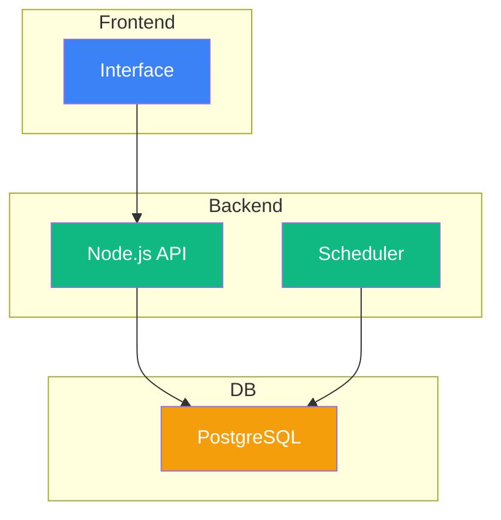
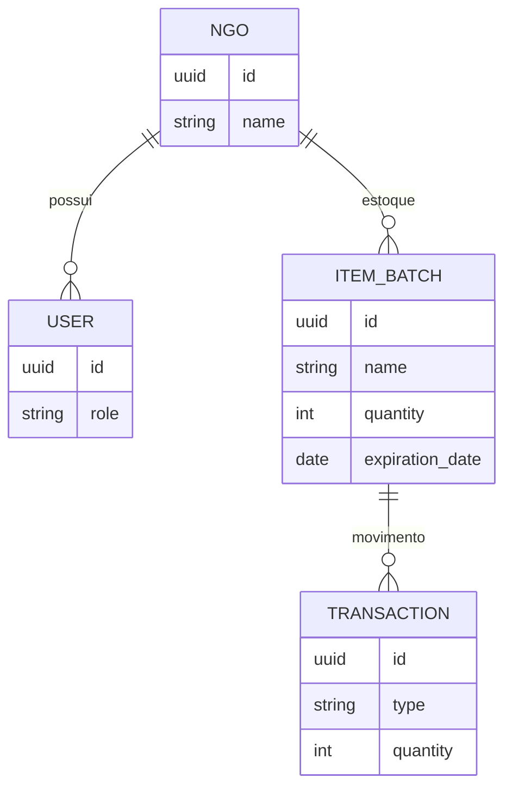

# 📦 DoaFlow - Gestão Inteligente para o Terceiro Setor

<p align="center">
  
  
  
  
</p>

> **Ajudando quem ajuda, um lote por vez.** O DoaFlow é um sistema proativo de controle de estoque de doações desenhado para resolver o desperdício de itens perecíveis e garantir total rastreabilidade no Terceiro Setor.

---

## 🎯 O Problema e a Solução

**A Dor:** Instituições recebem milhares de doações (alimentos, roupas, higiene), mas gerenciam tudo no papel, de memória ou em planilhas não integradas. O resultado? **Alimentos vencem nas prateleiras enquanto famílias passam fome**, e a ONG perde a capacidade de prestar contas precisas aos doadores.

**A Solução (DoaFlow):** Um sistema de gestão construído sob três pilares:
1. **Controle por Lotes (Batches):** Foco na data de validade para priorizar entregas (método FIFO).
2. **Motor Proativo (Alertas):** O sistema avisa automaticamente o que está vencendo.
3. **Transparência Absoluta:** Toda saída exige uma justificativa, gerando logs de auditoria inalteráveis.

---

## 🚀 Como testar o MVP na sua máquina

Para o Hackathon, construímos este MVP focado em velocidade e sem dependências pesadas.

```bash
git clone https://github.com/sua-equipe/doaflow-mvp.git
```

Abra a pasta do projeto e execute:
- Duplo clique em `index.html`
- Ou use **Live Server** no VS Code

---

## 📁 Estrutura do Projeto

```text
doaflow-mvp/
 ┣ 📂 css
 ┃ ┗ 📜 style.css
 ┣ 📂 js
 ┃ ┣ 📜 app.js
 ┃ ┗ 📜 data.js
 ┣ 📂 docs
 ┣ 📜 index.html
 ┗ 📜 README.md
```

---

## 🏛️ Arquitetura (Visão Geral)



---

## 🗄️ Modelo de Dados



---

## 🧠 Decisões Arquiteturais

- **FIFO por lote:** evita desperdício
- **Banco relacional:** garante consistência
- **Alertas automáticos:** via scheduler

---

## 🔒 Requisitos Não Funcionais

- Segurança multi-tenant
- Performance com índices
- Offline-first (PWA)

---

## 💻 MVP Funcional (HTML + JS)

```html
<!-- Cole aqui o HTML gerado anteriormente -->
```

---

## 👨‍💻 Equipe

- Cauã Freire (Programador)
- Guilherme Forte (Designer)
- Octacílio Neto (Gestor)

---